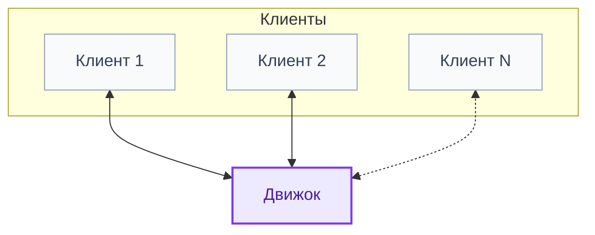

# Движок

> Чти Догмат, но включай и Голову. Ибо не всякий провод, обозначенный на схеме «черным» воистину черен, и не всякий «белый» на самом деле бел. Помни — неисповедимы пути Конвейера, и Руководство По Ремонту следует уважать, но понимать метафорически.
>
> *Павел Иевлев, УАЗДао 2:15*

Это документация по архитектуре движка. За основу взята гексагональная архитектура. Полная ясность того, что представляет из себя данный вид не является основанием для малословности. Многое здесь будет повторением того, чем является гексагональная архитектура. Однако, стоит и сказать о том, что документация не претендует на абсолютную полноту, поэтому перед её прочтением следует изучить основы гексагональной архитектуры.

[Описание идей гексагональной архитектуры](zen/hexarch.md).

## Контекст

Движок взаимодействует исключительно с клиентами

Клиентом является любое приложение, которое умеет создавать соединение. То есть на одном устройстве может быть несколько клиентов. В данный момент предполагается, что клиенты могут пользоваться только WebSocket соединениями.

## Документация по слоям

- [Документация по доменному слою](domain/README.md).
- [Документация по прикладному слою](application/README.md).
- [Документация по слою адаптеров](adapters/README.md).
