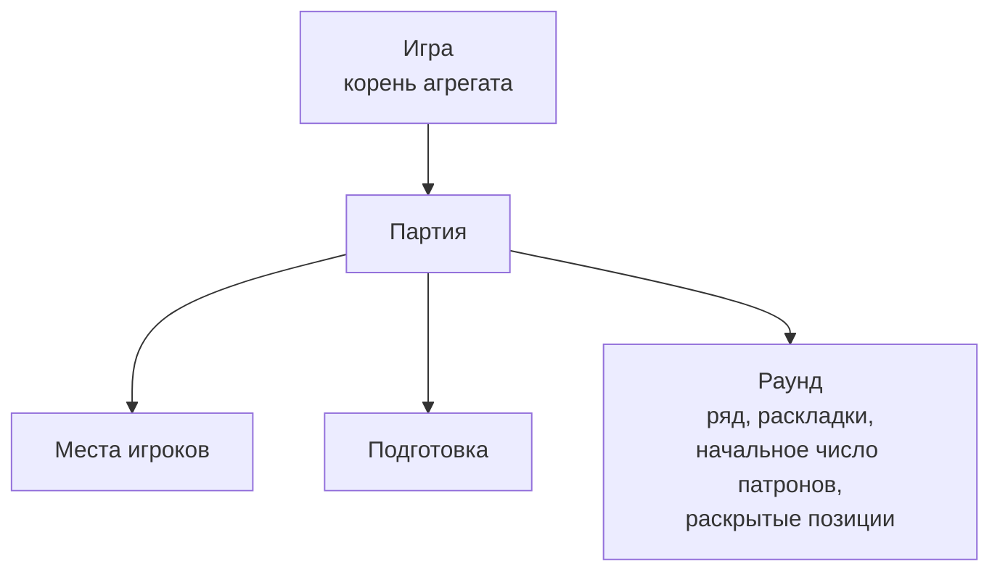

# Доменный слой

Модель домена, согласованная шаг за шагом сверху вниз. Правила, на
которых она основана, — в [`docs/rules/`](../../rules/README.md).

## Устройство

Пока партия идёт, у неё есть либо подготовка, либо раунд.

| Файл | О чём |
| --- | --- |
| [Игра](game.md) | Состояния, что хранит, команды лобби и присутствия, снимок |
| [Партия](match.md) | Состояния, что хранит, снимок |
| [Подготовка](preparation.md) | Фазы, что хранит, команды, снимок |
| [Раунд](round.md) | Что это, команды, исход, снимок |

## Принципы

Модель опирается на [принципы архитектуры](../zen/principles.md).

## Команды и снимок

**Команда** — то, что меняет состояние. Команды каждого уровня описаны в
его файле.

**Снимок** — то, что клиент может запросить в любой момент и в любом
состоянии (см. [принцип 2](../zen/principles.md#2-клиент-воссоздаёт-картину-мира-сам)).
Запрос снимка ничего не меняет. Клиент знает свой ID после Join, поэтому в
снимке его нет. Снимок каждого уровня описан в его файле.

Снимок — это **текущее состояние, а не история**. Что произошло
(результаты выстрелов, эффекты предметов), движок сообщает отдельными
сообщениями в момент события — по правилам и предметам.

Прошедшее движок не пересылает заново — см.
[видимость](../../rules/visibility.md).

**Историю событий** (`event_history`) ведёт исключительно прикладной
слой: он дописывает в неё события, которые вернули правила, через
исходящий порт и отдаёт её после конца игры. Домен возвращает события и
сообщения, но не знает, где события хранятся и как сообщения доставляются.
