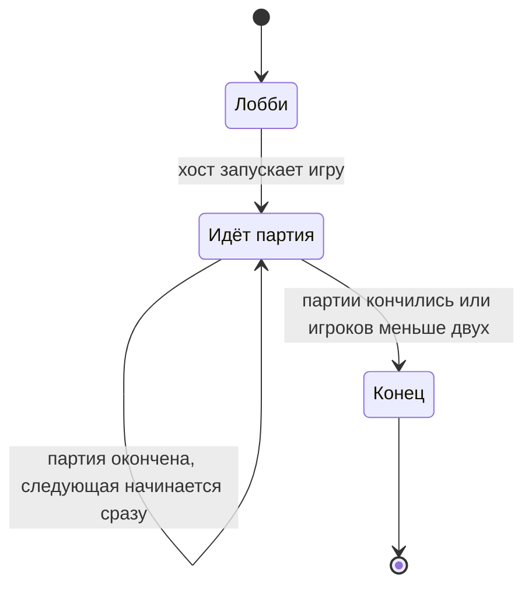

[← Доменный слой](README.md)

# Игра

Игра (`Game`) — корень агрегата: всё от лобби до конца игры.

## Состояния

Отдельного состояния «между партиями» нет: новая партия начинается сразу
после окончания предыдущей. Из состояния «Конец» игра никуда не уходит:
движок ждёт, пока хост его закроет (см. [игру](../../rules/game.md)).
Партии в состоянии «Конец» нет.

## Что хранит игра

Только то, что требуют правила на уровне игры. Всё, что внутри партии,
описывается отдельно.

| Что хранит игра | Из какого правила |
| --- | --- |
| Состояние: лобби / идёт партия / конец | Состояния игры |
| Настройки хоста | Хост задаёт число партий, предметы, лимит руки, жизни |
| Кто хост | Только хост меняет настройки и запускает игру |
| Список игроков | Кто сделал Join; после старта состав не меняется |
| Присутствие каждого игрока | На связи / нет связи / выбыл, действует всю игру |
| Сколько партий начал каждый | Правило справедливого первого хода |
| Сколько партий сыграно | Игра кончается, когда сыграны все партии |
| Текущая партия | Только в состоянии «Идёт партия». См. [партию](match.md) |

Итоги и история не хранятся. Лог игры — забота прикладного слоя, см.
[доменный слой](README.md#команды-и-снимок).

## Команды

### В лобби

| Команда | Кто | Что делает |
| --- | --- | --- |
| Присоединиться (Join) | клиент | Становится игроком; первый присоединившийся — хост. Сколько игроков допустимо — см. [игрока](../../rules/player.md) |
| Выйти | движок, по потере связи | Игрок выходит из лобби. Если это хост — см. [игру](../../rules/game.md) |
| Задать настройки | хост | Настройки и когда их можно менять — см. [игру](../../rules/game.md) |
| Запустить игру | хост | Сколько игроков нужно — см. [игрока](../../rules/player.md). Игра переходит в «Идёт партия» |

### Присутствие (после старта, в любом состоянии)

Эти команды приходят не от игрока, а от движка: адаптер замечает потерю
связи и следит за временем. Домен о времени ничего не знает — он получает
уже готовую команду.

| Команда | Что делает |
| --- | --- |
| Связь потеряна | Игрок — «нет связи». Что при этом принимается и отклоняется — см. [потерю связи](../../rules/player.md#потеря-связи) |
| Связь восстановлена | Игрок снова «на связи». Если больше никто не отсутствует, игра продолжается |
| Время вышло | Игрок выбывает насовсем (см. [игрока](../../rules/player.md)); затем проверяется конец партии и игры |

## Снимок

Что входит в снимок игры (кто что видит — см.
[видимость](../../rules/visibility.md)):

- состояние: лобби / идёт партия / конец;
- настройки хоста;
- кто хост;
- список игроков и присутствие каждого;
- сколько партий сыграно;
- текущая партия — только в состоянии «Идёт партия», см.
  [снимок партии](match.md#снимок). В лобби и после конца игры партии
  в снимке нет.

«Сколько партий начал каждый» в снимок не входит: это служебные данные
движка для выбора первого хода.
