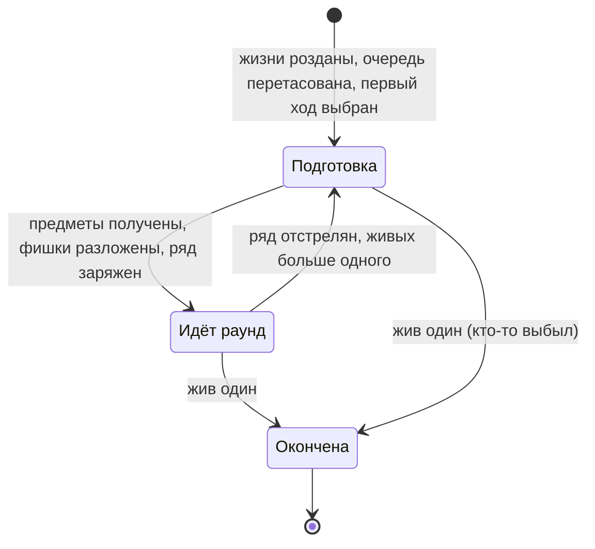

[← Доменный слой](README.md)

# Партия

Партия (`Match`) — часть игры от раздачи жизней до момента, когда в
живых остаётся один игрок.

## Состояния

Где проходит граница между подготовкой и раундом — см.
[раунд в правилах](../../rules/round.md).

## Что хранит партия

| Что хранит партия | Из какого правила |
| --- | --- |
| Место каждого игрока | Жизни, предметы, фишки живут в месте и переносятся между раундами |
| Очередь хода (круг) | Тасуется при старте партии и не меняется до её конца |
| Чей сейчас ход | [Ход](../../rules/turn.md), [первый ход](../../rules/match.md#первый-ход) |
| Номер хода | Какой по счёту идёт ход в партии — см. [ход](../../rules/turn.md) |
| Состояние подготовки | Только в подготовке. См. [подготовку](preparation.md) |
| Раунд: ряд, раскладки, начальное число патронов, раскрытые позиции | Только пока идёт раунд. См. [раунд](round.md) |

Победитель не хранится: это единственный живой, когда партия окончена.

## Снимок

Что входит в снимок партии (кто что видит — см.
[видимость](../../rules/visibility.md)):

- состояние: подготовка / идёт раунд / окончена;
- очередь хода (круг), чей сейчас ход и номер хода;
- всё о каждом месте: жизни, жив ли, рука, эффекты, фишки;
- подготовка или раунд — см. снимок [подготовки](preparation.md#снимок) и
  [раунда](round.md#снимок).

Раскрытые позиции и их веса — не часть места, а часть
[раунда](round.md#снимок): они относятся к ряду и исчезают вместе с ним.
