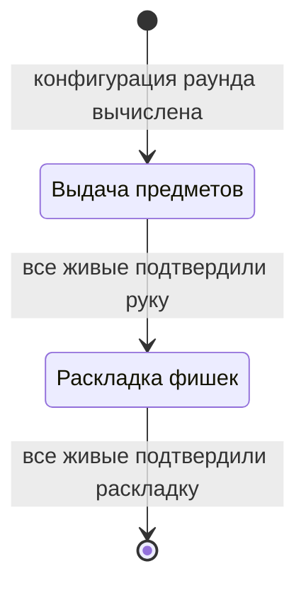

[← Доменный слой](README.md)

# Подготовка

Состояние партии перед каждым раундом.

Как проходят фазы и кто их подтверждает — см.
[подготовку в правилах](../../rules/round.md#подготовка).

## Что хранит подготовка

| Что хранит подготовка | Зачем |
| --- | --- |
| Конфигурация раунда | Число камор нужно уже для раскладки, слои — для выдачи, число патронов — при зарядке в конце подготовки |
| Текущая фаза | Выдача или раскладка |
| Выпавшие предметы каждого живого | Игрок выбирает руку из «старые + выпавшие» |
| Выбранная рука каждого живого | Становится рукой места, когда выдача закончилась |
| Раскладка каждого, кто её отправил | Из всех раскладок складываются веса камор; раскладка выбывшего после отправки тоже учитывается |
| Кто уже подтвердил текущую фазу | Фаза заканчивается, когда подтвердили все живые |

Когда подготовка закончилась, от неё остаются заряженный ряд, раскладки
игроков и начальное число патронов — из них рождается раунд. Раскрытых
позиций у нового раунда ещё нет. Всё остальное больше не нужно.

## Команды

Обе команды отправляет живой игрок. Отправка и есть подтверждение:
отдельной команды «подтвердить» нет. Решение окончательное — повторная
отправка в той же фазе отклоняется.

| Команда | Когда | Что делает |
| --- | --- | --- |
| Выбрать руку | Фаза выдачи | Новая рука; какая допустима — см. [выдачу](../../rules/items.md#выдача). Когда подтвердили все живые — начинается раскладка |
| Разложить фишки | Фаза раскладки | Раскладка пула; какая допустима — см. [раскладку](../../rules/chips.md#раскладка). Когда подтвердили все живые — ряд заряжается, начинается раунд |

## Снимок

В снимке подготовки — только то, что нужно для действий в текущей фазе.
Остальное живёт на своём уровне. Кто что видит — см.
[видимость](../../rules/visibility.md).

Что входит в снимок подготовки:

- текущая фаза: выдача / раскладка;
- число камор;
- кто подтвердил текущую фазу;
- свои выпавшие предметы;
- своё отправленное решение (рука или раскладка).

Чего в снимке подготовки нет:

- **число патронов** — оно в снимке раунда как «начальное число патронов»;
- **руки игроков** — новая рука становится рукой места, когда выдача
  закончилась, и дальше видна всем через снимок места;
- **слои раунда** — внутренняя логика движка;
- **чужие выпавшие предметы и чужие решения** — их незачем рассылать.
