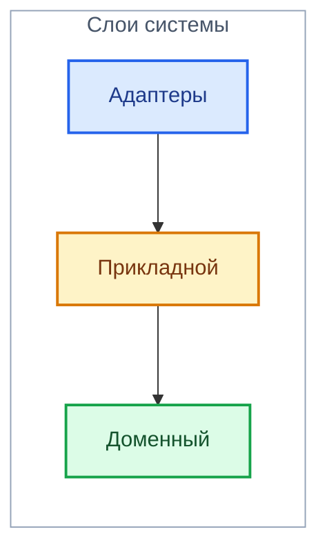

# Гексагональная архитектура

> Общее описание гексагональной архитектуры. Возможно, чисто для себя.

Система состоит из слоёв: *доменный слой*, *прикладной слой* и *адаптеры*. Каждый из них прост в ответственности, однако этого нельзя сказать про реализацию. Сразу стоит сказать, что доменный и прикладной слои не хранят состояния. Каждый вызов получает всё необходимое для выполнения операции через свои входные данные и возвращает результат наружу.  Рассмотрим каждый из них снизу вверх.

## Доменный слой

Это слой сущностей, которые лежат в основе всего, чем мы тут вообще занимаемся. Домен - это область знаний или интересов. В данный момент нашим доменом является игра `Live`. И все сущности, которые в этой игре есть, описываются именно на доменном слое.

Если представить, что нашим доменом является игра шахматы, то этот слой содержал бы (возможно, зависит от того, что вам нужно) доску, фигуры (способ их ходьбы, стоимость) и правила.

## Прикладной слой

Он занимается тем, что манипулирует объектами. Можно сказать, что именно этот слой выполняет действия. Продолжим пример про шахматы. Прикладной слой - это робот, к которому каждый раз приходят с доской и фигурами в определённом состоянии и говорят "Сделай *то-то*". Естественно, что если инварианты домена позволяют, то робот соглашается, иначе он говорит "Nein!". Под инвариантами в примере с шахматами может быть:

- Нельзя рубить собственные фигуры
- Конь ходит буквой *Гэ*
- и так далее

Описывая этот слой более техническими терминами, мы говорим, что он оркеструет сущности. То есть собирает нужные для действия объекты в одном месте и делает что-то.

## Слой адаптеров

Назван он так из-за того, что *адаптирует* общение с внешним миром для прикладного слоя. Мне долго приходилось привыкать к этому названию, но я смог, и вы сможете. Возможно, это самая геморная в плане понимания сторона гексагональной архитектуры.

### Лирическое отступление - внешний мир

Первый слой, который не плавает в вакууме и умеет *щупать наружу*. Что мы понимаем под этим? Это важно понимать метафорически. **Внешний мир** - это всё, состояние или поведение чего находится за пределами системы и может изменяться независимо от него. Немного примеров:

- Время (и всё, что с ним связано)
- Клиент
- Базы данных
- Файловая система
- Случайный генератор

### Главные вопросы

Перед тем, как понять, как конкретно работает этот слой, давайте перечислим, чего хочет слой ниже.

1. **Быть вызванным**. Зачем нам вообще тогда нужен этот слой, если его никто не будет вызывать?
2. **Данные, сущности и выход во внешний мир**. Данные и сущности в целом можно объединить, однако выход во внешний мир это инструменты, которыми этот слой умеет самостоятельно лезть во внешний мир за информацией или с целью изменить состояние.

Гексагональная архитектура (и я) решаем эти вопросы так:

1. Driving или `inbound` адаптеры (далее `inbound`)
2. Driven или `outbound` адаптеры (далее `outbound`)

И отдельно - Composition Root (далее `nexus`)

Понятно? Хыхыхммхм угум продовжуй угум...

### `Inbound` адаптеры

Это то, что пинает прикладной слой. Точка инициации, начало, старт, запуск, отплытие... Может быть что-угодно, что умеет доставать прикладной слой и заставлять его что-то делать. Это может быть CRON, HTTP запрос, CLI, системный сигнал и так далее.

Вы можете подумать: "Как HTTP запрос умеет вызывать прикладной слой?". Напрямую никак. Именно для этого и нужны `inbound` адаптеры. Вы пишете обработчик HTTP запроса вызываемый ASGI, который в свою очередь получает прикладной слой и вызывает нужные вам функции. Бинго! Адаптер именно поэтому так называется, потому что он приспосабливает разные точки входа внешнего мира.

### `Outbound` адаптеры

Допустим, прикладной слой мы вызвали. Но как же он сам общается с внешним миром? Обычно прикладному слою нужно решать такие проблемы:

- Хочу достать файл с диска
- Хочу записать значение в БД
- Хочу отправить почту
- и так далее

Для этого существуют ведомые адаптеры, которые передаются прикладному слою. Эти адаптеры решают свою минимальную проблему: чтение файлов, управление погодой, откатить время вспять, ну вы поняли ***:3***

Однако, как адаптеры и прикладной слой договариваются, какие функции должны быть у инструментов? Интерфейсы, или в случае Python протоколы и абстрактные классы. Прикладной слой объявляет интерфейс, а адаптер уже его реализует.

### `Nexus`

Это что за чудо-юдо? Если вы сами пишете систему, то должны были задаться вопросом - че вообще происходит-то? Как `inbound` адаптеры вызывают прикладной слой? Как прикладной слой получает `outbound` адаптеры? При каждом пинке? При инициализации? И где происходит эта инициализация? А если при пинке, то откуда пинок берёт реализацию? Каждый раз создаёт новый объект?

Куча вопросов и ноль ответов. На самом деле, вряд ли вы поймёте, что тут написано, пока сами не попробуете реализовать приложение на гексагональной архитектуре. Итак, к ответам.

#### Самая сраная часть

`Nexus` - место в системе, которое знает всех. Это место силы. Прикладной слой знает только интерфейсы. Адаптер знает только свой кусочек внешнего мира.

Теперь ответы на вопросы выше:

- **Откуда прикладной слой берёт `outbound` адаптеры?** Ниоткуда. Он их не создаёт и не ищет, их ему передаёт `nexus` при создании.
- **Как `inbound` адаптер вызывает прикладной слой?** При старте `nexus` собирает всё приложение в кучу и выдаёт `inbound` адаптерам готовые объекты или фабрики, которые создают их на каждый пинок.
- **Где всё это происходит?** Сборка происходит в самой внешней точке, обычно в точке входа. Можете делать это где хотите (только не приходите ко мне домой). На `nexus` не зависит никто, а он зависит от всех.

## Недосказанности

Здесь не было сказано о том, что на самом деле интерфейсы называются портами, и порты могут быть не только у прикладного слоя, но и у доменного. Но это приходит с опытом.

Инфа для чтения:

- [Хабр](https://habr.com/ru/companies/timeweb/articles/771338/)
- [Тпрогер](https://tproger.ru/articles/razbiraem-hexagonal-architecture-i-ee-primenenie)

Сначала прочувствуй всё это...
