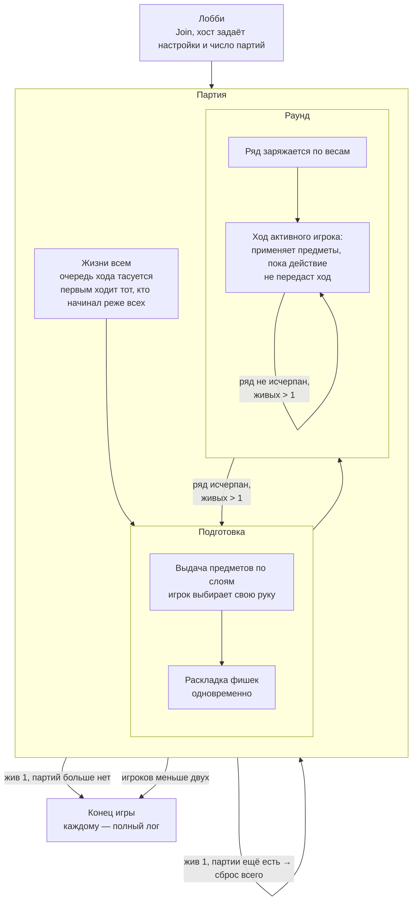

# Правила игры

Рабочий свод правил. Что ещё не решено — в
[открытых вопросах](../README.md#открытые-вопросы).

## Идея

N игроков сидят за столом. Перед ними — каморный ряд (не револьвер
физически), выложенный на столе. Игроки по очереди выбирают камору и
цель и стреляют. Это самый обычный ход; в общем случае игрок в свой ход
применяет предметы, а выстрел — один из них (см. [ход](turn.md)). Игра
идёт партиями, партия — раундами, раунд — ходами.

## Составляющие

| Файл | О чём |
|---|---|
| [Игра](game.md) | Лобби, хост и его настройки, конец игры, лог |
| [Игрок](player.md) | Состав, присутствие, жизнь в партии, потеря связи |
| [Партия](match.md) | Жизни, очередь хода, первый ход, конец партии |
| [Раунд](round.md) | Подготовка к раунду, раунд, конфигурация |
| [Предметы](items.md) | Выдача по слоям, классификация, описания |
| [Фишки](chips.md) | Как зарабатываются и во что превращаются |
| [Каморный ряд](chamber_row.md) | Состояния камор, зарядка по весам |
| [Ход](turn.md) | Что делает активный игрок |
| [Видимость](visibility.md) | Кто что знает |
