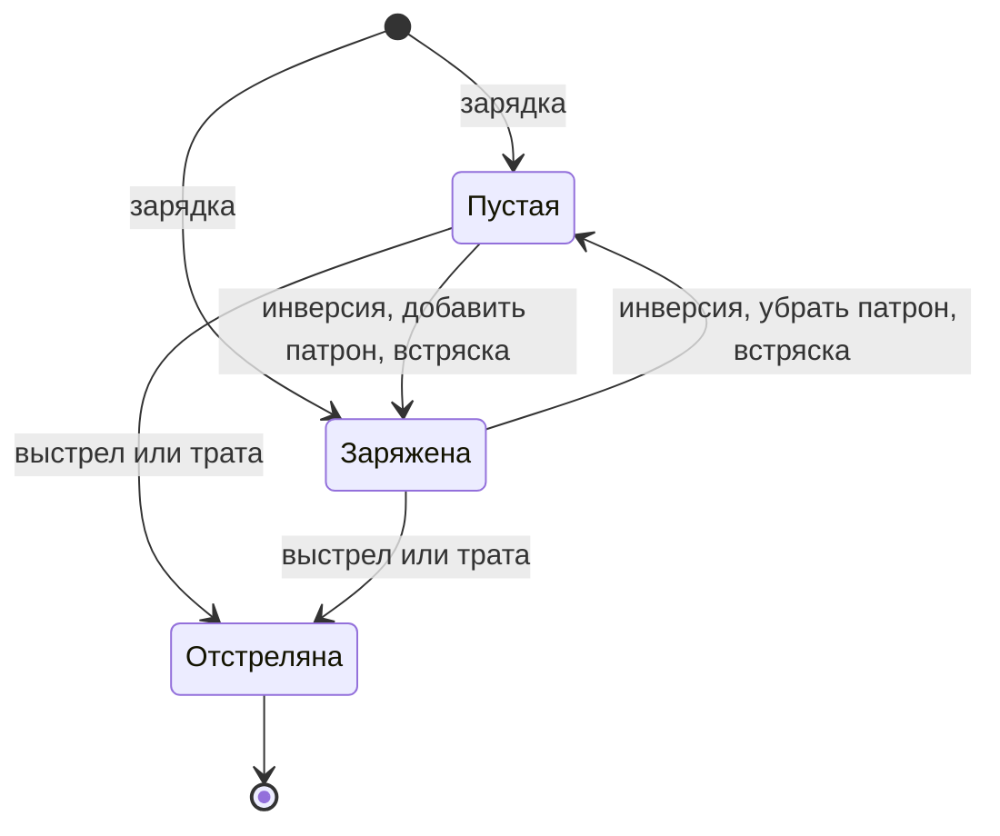

[← Правила игры](README.md)

# Каморный ряд

- **Зарядка.** Ряд заряжается один раз, сразу весь, по весам камор: чем
  больше вес, тем выше шанс получить патрон. Число патронов объявляется **публично**
  в этот момент — после раскладки фишек («2 патрона из 8»); какие именно
  каморы заряжены — скрыто. Число камор известно раньше, до раскладки.
- **Отстрелянная камора** выбывает навсегда: её нельзя ни инвертировать,
  ни потратить повторно, ни зарядить встряской.
- **Изменения ряда предметами** (подробно — в [`items.md`](items.md)):
  - инверсия меняет содержимое каморы напрямую и тем самым реально меняет
    число патронов в ряду;
  - добавленный патрон попадает в пустую камору, выбранную по весу;
  - убранный патрон снимается с заряженной каморы, выбранной обратно
    весу: тяжёлую разряжают реже;
  - встряска заново раскладывает те же патроны по неотстрелянным каморам
    с теми же весами;
  - трата расходует камору без выстрела: её исход никому не вредит.
