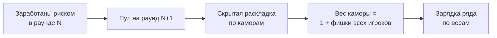
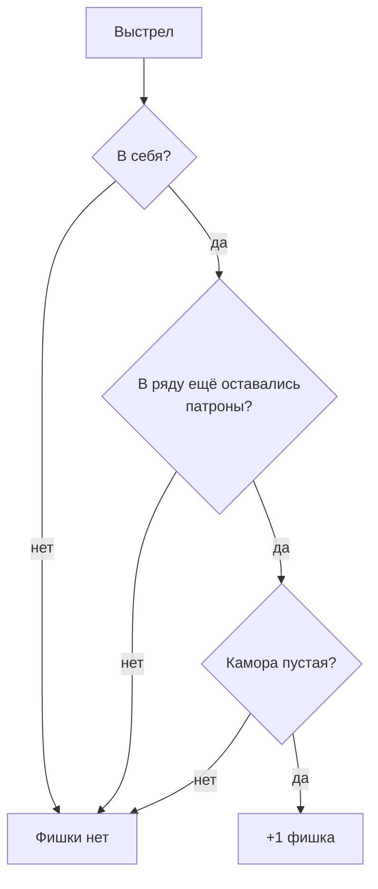

[← Правила игры](README.md)

# Фишки

Фишки — единственный способ влиять на то, где окажутся патроны. Их
зарабатывают риском и тратят на раскладку.

## Как заработать

- Фишка выдаётся, только если игрок стреляет в **себя**, камора пустая,
  **и** на момент выстрела в ряду оставался хотя бы один ненайденный
  патрон. Без риска фишки нет, независимо от исхода.
- Выдача или невыдача фишки — публичное событие. Оно косвенно, но
  однозначно показывает, остались ли в ряду патроны, не раскрывая их
  числа.

## Раскладка

- Пул фишек игрока на раунд равен тому, что он заработал в предыдущем
  раунде. В первом раунде партии — 0 у всех.
- Перед раскладкой игроки знают число камор в ряду, но не число
  патронов — его объявляют только при зарядке.
- Все живые игроки одновременно и скрытно раскладывают свои фишки (вес 1
  каждая) по каморам как хотят, в том числе несколько в одну камору.
  Каждый видит только свою раскладку.
- Раскладывается **весь пул**: оставить фишки на следующий раунд или
  выбросить их нельзя. Игрок с пустым пулом всё равно подтверждает
  раскладку.
- Раскладка окончательная: после завершения фазы её не изменить.
- Фишки суммируются по каморам в скрытую итоговую раскладку весов. У
  каждой каморы есть ненулевой базовый вес — иначе камору, которую никто
  не тронул, нельзя было бы зарядить.
