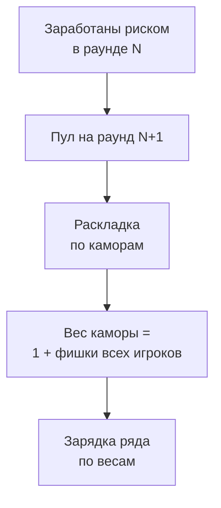
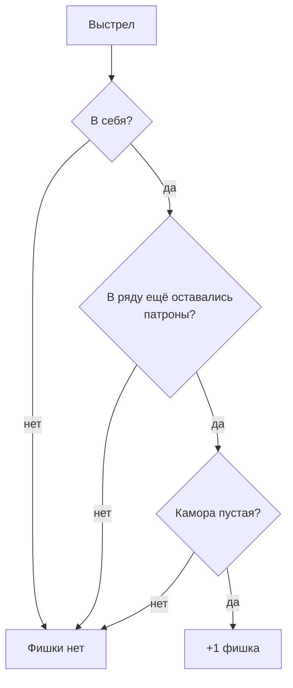

[← Правила игры](README.md)

# Фишки

Фишки — единственный способ повлиять на зарядку ряда: на то, где
окажутся патроны, когда ряд заряжается. Их зарабатывают риском и тратят
на раскладку.

## Как заработать

- Фишка выдаётся, только если игрок стреляет в **себя**, камора пустая,
  **и** на момент выстрела в ряду оставался хотя бы один патрон. Без
  риска фишки нет, независимо от исхода.

## Раскладка

- Пул фишек игрока на раунд равен тому, что он заработал в предыдущем
  раунде. В первом раунде партии — 0 у всех.
- Все живые игроки одновременно раскладывают свои фишки (вес 1 каждая)
  по каморам как хотят, в том числе несколько в одну камору.
- Кто что знает о фишках и ряде — см. [видимость](visibility.md).
- Раскладывается **весь пул**: оставить фишки на следующий раунд или
  выбросить их нельзя. Игрок с пустым пулом всё равно подтверждает
  раскладку.
- Раскладка окончательная: после завершения фазы её не изменить.
- Фишки суммируются по каморам в итоговую раскладку весов. У
  каждой каморы есть ненулевой базовый вес — иначе камору, которую никто
  не тронул, нельзя было бы зарядить.
