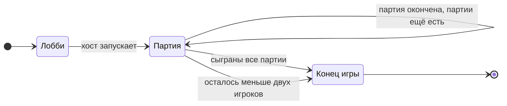

[← Правила игры](README.md)

# Игра

- Игра начинается в лобби: клиенты присоединяются (Join) и становятся
  игроками. Среди игроков есть **хост**: он запускает движок и первым к
  нему подключается. Хост задаёт настройки игры и запускает её.
- **Настройки хоста:**
  - число партий;
  - какие предметы участвуют в игре;
  - максимальное число предметов на руках;
  - минимальное и максимальное число жизней.

  Допустимые значения: партий не меньше одной, минимум жизней не меньше
  одной и не больше максимума, лимит предметов на руках не меньше нуля.
- Игра заканчивается, когда сыграны все партии, заданные хостом, или
  досрочно — если из-за выбываний осталось меньше двух игроков.
- Движок работает у хоста. Если хост закрывает движок, игра
  прекращается. Если же клиент хоста просто потерял связь, а движок
  работает, к хосту применяются обычные правила потери связи.
- **Лог игры.** В конце игры каждый игрок может получить полный лог: все
  события игры, включая то, что во время игры было скрыто (раскладки
  фишек, содержимое камор, раскрытое предметами). Игра окончена, прятать
  больше нечего. Статистика (победители партий и прочее) считается из
  лога; отдельных итогов движок пока не ведёт.
