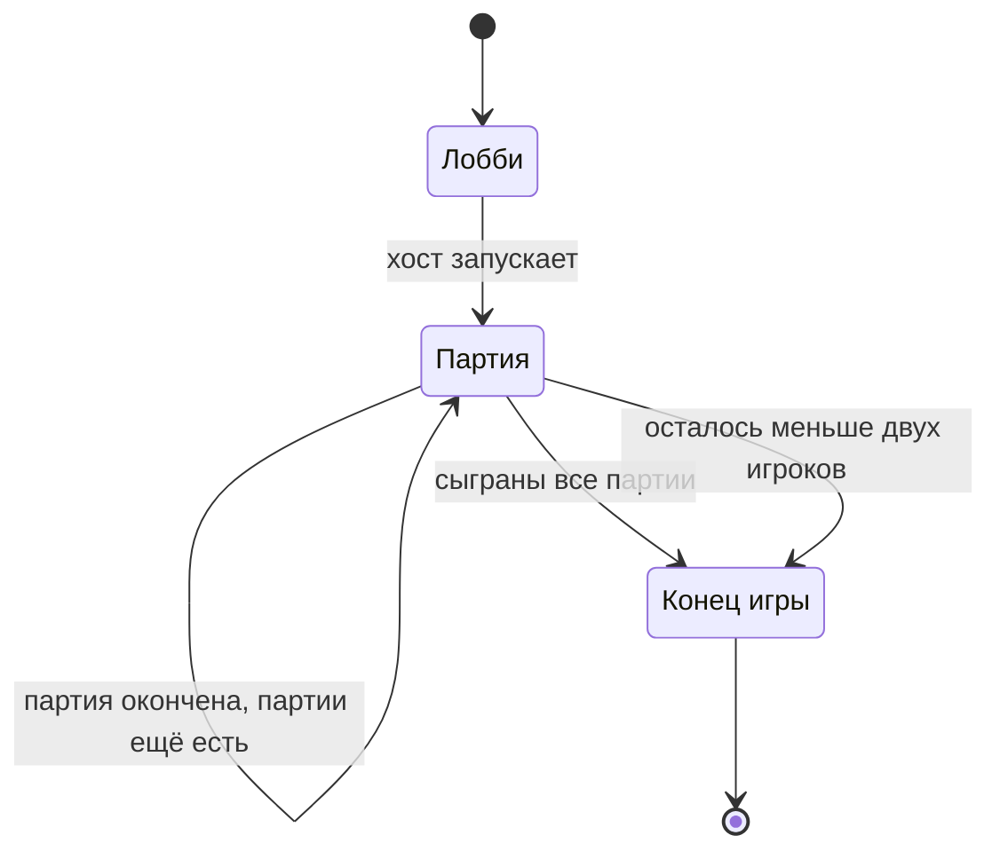

[← Правила игры](README.md)

# Игра

- Игра начинается в лобби: клиенты присоединяются (Join) и становятся
  игроками. Среди игроков есть **хост**: он запускает движок и первым
  делает Join. Хост задаёт настройки игры и запускает её. Настройки можно
  менять сколько угодно раз до старта; изменения видят все.
- **Настройки хоста:**
  - число партий;
  - какие предметы участвуют в игре (кроме выстрела: он участвует
    всегда, см. [выстрел](turn.md#выстрел));
  - максимальное число предметов на руках;
  - минимальное и максимальное число жизней.

  Допустимые значения: партий не меньше одной, минимум жизней не меньше
  одной и не больше максимума, лимит предметов на руках не меньше нуля.

  У каждой настройки есть значение по умолчанию: игру можно запустить,
  ничего не меняя.
- Игра заканчивается, когда сыграны все партии, заданные хостом, или
  досрочно — если из-за выбываний осталось меньше двух игроков.
- Движок работает у хоста. Если хост закрывает движок, игра
  прекращается.
- Если клиент хоста потерял связь:
  - **в лобби** — игра прекращается, как если бы хост закрыл движок;
  - **после старта** — к хосту применяются обычные правила
    [потери связи](player.md#потеря-связи).
- **После конца игры** движок ждёт, пока хост его закроет. Всё это время
  каждый может запросить историю событий.
- **История событий.** В конце игры каждый игрок может получить историю
  событий: все события игры по порядку, включая то, что во время игры
  было скрыто (раскладки фишек, содержимое камор, раскрытое предметами).
  Игра окончена, прятать больше нечего. Статистика (победители партий и
  прочее) считается из неё; отдельных итогов движок пока не ведёт.
