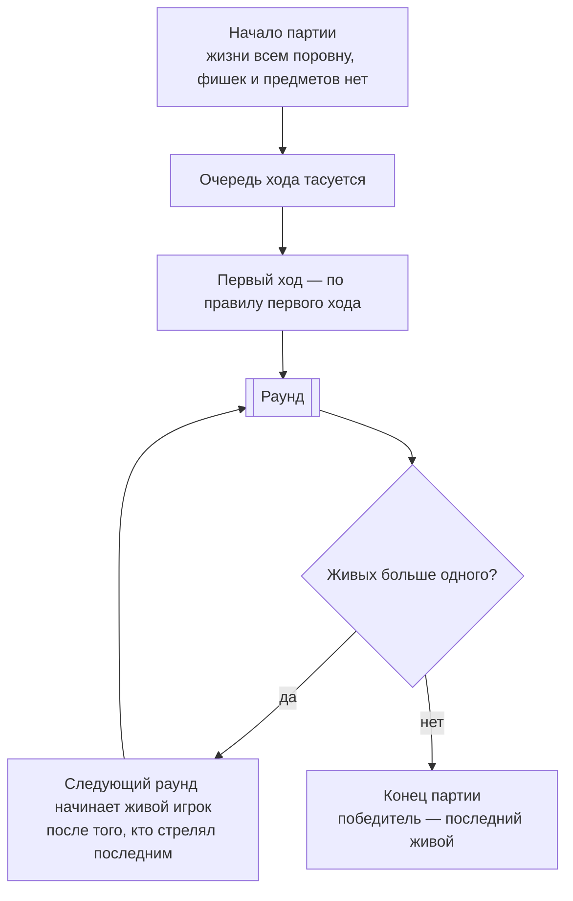
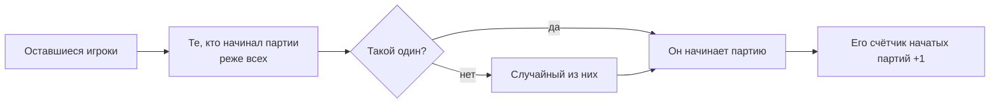

[← Правила игры](README.md)

# Партия

- **Жизни.** В начале партии движок выбирает число жизней в пределах от
  минимума до максимума, заданных хостом, — одно и то же для всех
  игроков. Как и конфигурация раунда, это одна заменяемая формула;
  **текущая** — случайное число от минимума до максимума. Дальше жизни
  тратятся и переносятся между раундами без сброса.
- Партия заканчивается, когда в живых остаётся ровно один игрок. Это
  условие партии целиком, а не отдельного раунда.
- Когда партия заканчивается, сбрасывается всё: жизни, фишки, предметы у
  всех игроков. Следующая партия начинается с нуля.
- **Очередь хода** — это круг. Она тасуется случайно один раз при старте
  партии и не меняется до её конца; первый ход определяет, с кого круг
  начинается; следующая партия тасует заново — сознательно, как
  фича, а не только ради баланса.

## Первый ход

Каждый игрок должен одинаково часто начинать партию. Так у оставшихся
игроков разница в числе начатых партий никогда не превышает одной, даже
если кто-то выбыл насовсем. Расписание заранее не составляется.

Первый раунд партии начинает выбранный так игрок. Каждый следующий раунд
начинает живой игрок, следующий по кругу за тем, кто стрелял последним в
прошлом раунде.
