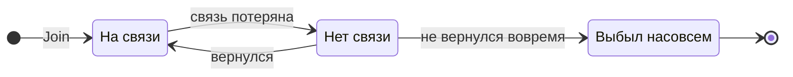
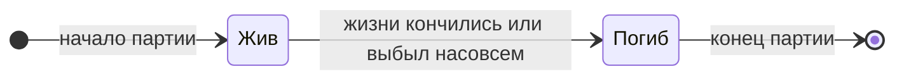

[← Правила игры](README.md)

# Игрок

- За столом от 2 до 6 игроков. Состав фиксируется при старте игры и не
  меняется до конца: присоединиться посреди игры нельзя.
- У игрока два независимых состояния: **присутствие** (на всю игру) и
  **жизнь** (в пределах партии).

## Присутствие

В лобби, до старта игры, потеря связи означает просто выход из лобби
(что происходит, если так вышел хост, — см. [игру](game.md)). Описанные
здесь правила присутствия действуют после старта.

Единственный способ выбыть насовсем — окончательно потерять связь.
Время на возвращение задаёт движок.
Выбывший в текущей партии считается погибшим и больше не участвует в
следующих.

## Жизнь в партии

Гибель временная: в следующей партии игрок снова жив (если не выбыл
насовсем).

## Потеря связи

- **Игра ждёт.** Пока кто-то без связи, игроки не действуют: выстрелы и
  применения предметов отклоняются, поэтому действием ход не передаётся.
  Ждут любого отключившегося — в том числе уже погибшего в этой партии.
  Это касается и хода самого отсутствующего: за него никто не стреляет, и
  его ход не пропускается. Ожидание блокирует только действия игроков: если
  активный игрок погиб или выбыл, ход переходит к следующему живому и во
  время ожидания (см. [ход](turn.md)).
- **Решения фаз принимаются.** Раскладка фишек и новая рука после
  выдачи предметов — окончательные решения каждого, они не зависят от
  отсутствующего. Их принимают от присутствующих игроков в любой момент
  фазы, даже если кто-то без связи. Фаза завершается, когда решили все
  оставшиеся живые игроки — даже если кто-то из решивших сейчас без
  связи. Вернувшись, он узнает, что изменилось.
- **Выбывание посреди фазы.** Выбывшего больше не ждут. Если все
  остальные уже решили, фаза завершается. Уже сделанная им раскладка
  фишек окончательна и учитывается в весах ряда.
