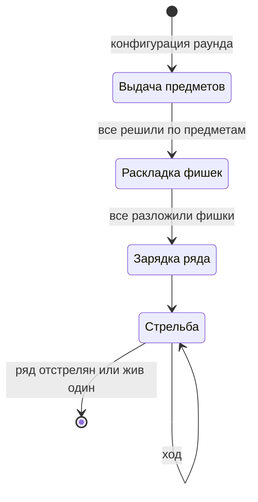
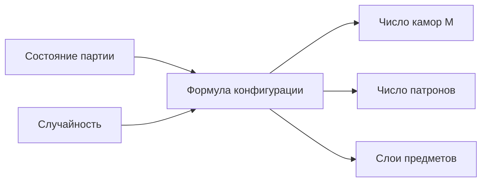

[← Правила игры](README.md)

# Раунд

Раунд — один цикл «раздать предметы → разложить фишки → зарядить ряд →
отстрелять его». В фазах раунда участвуют только **живые** игроки.

Фазы выдачи предметов и раскладки фишек ждут **явного подтверждения** от
каждого живого игрока — даже если ему решать нечего (нет новых предметов
сверх лимита, 0 фишек). Как это показать игроку, решает клиент.

Подробнее о фазах: [выдача предметов](items.md#выдача),
[раскладка фишек](chips.md#раскладка), [зарядка ряда](chamber_row.md),
[ход](turn.md).

Раунд заканчивается одним из двух способов:

- **Ряд полностью отстрелян**, живых больше одного — начинается новый
  раунд. Фишки и предметы **не сбрасываются**, переносятся в него.
- **Жив один игрок** — это одновременно конец партии.

## Конфигурация раунда

У каждого раунда три параметра: число камор в ряду (M), начальное число
патронов и набор слоёв предметов. Жизни в конфигурацию не входят — они
определяются один раз в начале партии.

Конфигурация вычисляется в начале раунда, но открывается по частям:
число камор и слои — сразу, число патронов — только при зарядке, после
раскладки фишек.

Конфигурацию в начале каждого раунда вычисляет движок по состоянию
партии. Задумка на будущее — **подстраивать её под партию**: число
оставшихся игроков, их жизни, накопленные фишки и предметы. Это основной
рычаг эскалации («первый раунд — судьба, дальше больше контроля») через
числа, без отдельных механик поверх экономики риска.

**Текущая формула — случайная.** Пока состояние партии не учитывается,
каждый раунд параметры выбираются заново:

- **Камор:** случайное число от 4 до 12.
- **Патронов:** случайное число от 1 до M − 1. Хотя бы один патрон есть
  всегда, и хотя бы одна камора остаётся пустой — иначе не было бы риска.
- **Слои предметов:** 2 или 3 слоя. Каждый слой выбирается случайно:
  обычный (1) — 60%, редкий (2) — 30%, потолочный (3) — 10%.

Формула — одна заменяемая точка: чтобы перейти к адаптивной, достаточно
поменять её, не трогая остальные правила.
