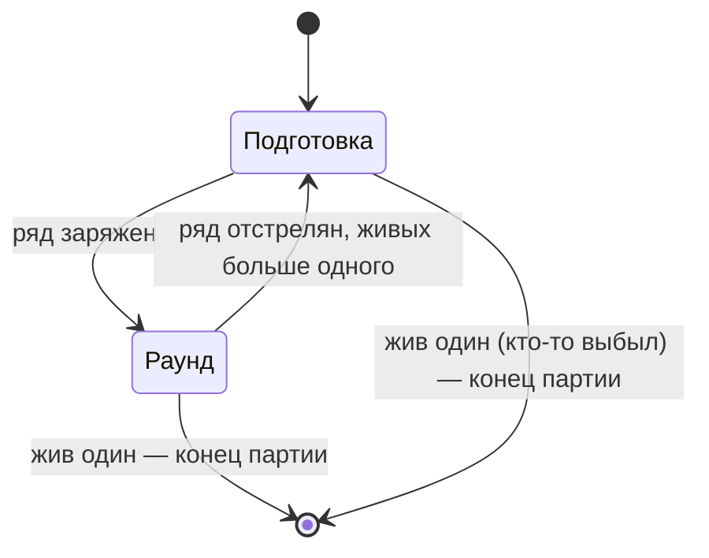
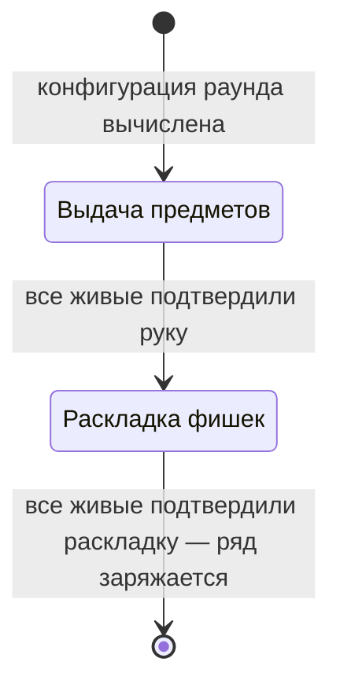
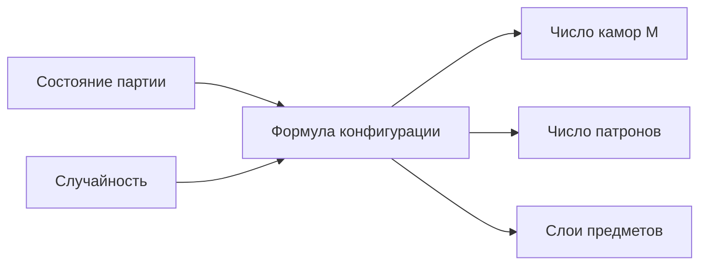

[← Правила игры](README.md)

# Раунд

**Раунд** — время жизни одного заряженного ряда. Он начинается, когда ряд
заряжен; когда он заканчивается — см. [ход](turn.md).
Перед каждым раундом идёт **подготовка**: раунда в это время ещё нет.

## Подготовка

Подготовка — состояние партии перед раундом. В ней участвуют только
**живые** игроки.

Обе фазы проходят всегда, по порядку, ничего не пропускается. Фазы
подготовки ждут **явного подтверждения** от каждого живого игрока —
даже если ему решать нечего (нет новых предметов сверх лимита, 0 фишек).
Как это показать игроку, решает клиент.

Подробнее: [выдача предметов](items.md#выдача),
[раскладка фишек](chips.md#раскладка), [зарядка ряда](chamber_row.md).

## Ход раунда

Раунд — это ходы игроков по очереди, пока он не закончится.

При переходе к следующему раунду фишки, предметы и эффекты **не
сбрасываются** — переносятся в него. Раскрытые позиции, наоборот,
**сбрасываются**: они относятся к ряду своего раунда, а у нового раунда
новый ряд.

## Конфигурация раунда

У каждого раунда три параметра: число камор в ряду (M), начальное число
патронов и набор слоёв предметов. Жизни в конфигурацию не входят — они
определяются один раз в начале партии.

Конфигурация вычисляется в начале подготовки. Что из неё и когда узнают
игроки — см. [видимость](visibility.md).

Конфигурацию в начале каждой подготовки вычисляет движок по состоянию
партии. Задумка на будущее — **подстраивать её под партию**: число
оставшихся игроков, их жизни, накопленные фишки и предметы. Это основной
рычаг эскалации («первый раунд — судьба, дальше больше контроля») через
числа, без отдельных механик поверх экономики риска.

**Текущая формула — случайная.** Пока состояние партии не учитывается,
каждый раунд параметры выбираются заново:

- **Камор:** случайное число от 4 до 12.
- **Патронов:** случайное число от 1 до M − 1. Хотя бы один патрон есть
  всегда, и хотя бы одна камора остаётся пустой — иначе не было бы риска.
- **Слои предметов:** 2 или 3 слоя. Каждый слой выбирается случайно:
  обычный (1) — 60%, редкий (2) — 30%, потолочный (3) — 10%.

Формула — одна заменяемая точка: чтобы перейти к адаптивной, достаточно
поменять её, не трогая остальные правила.
