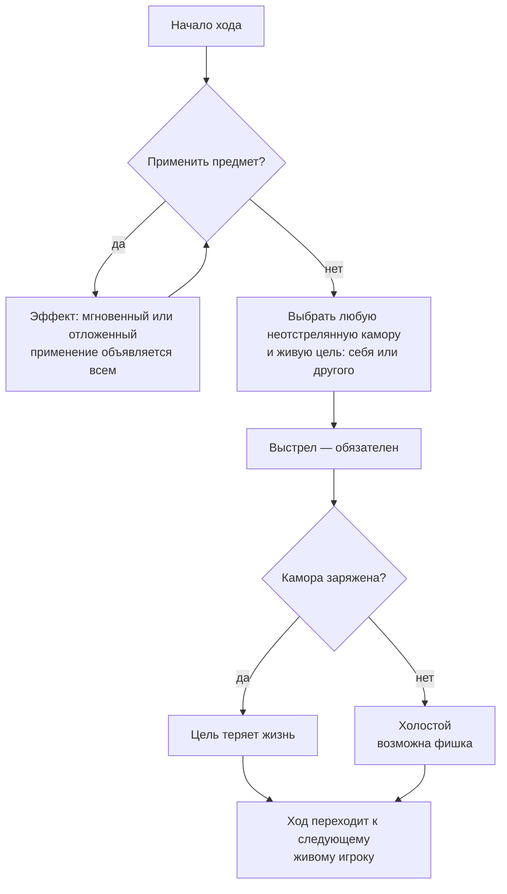

[← Правила игры](README.md)

# Ход

1. **Предметы.** Можно применить сколько угодно предметов — лимитирует
   только то, что их мало. Предметы применяются **только в свой ход**.
   Эффект может быть отложенным: например, щит активируется сейчас, а
   срабатывает позже, пассивно. **Все применения публичны**, если для
   конкретного предмета явно не решено иначе.
2. **Выбор.** Любая неотстрелянная камора (не по кругу, не курсором) и
   цель — себя или другой **живой** игрок.
3. **Выстрел обязателен.** Иначе раунд мог бы никогда не закончиться.
   Если камора заряжена — цель теряет жизнь.

**Передача хода.** После любого выстрела ход переходит к следующему
живому игроку, дополнительного хода нет ни при каком исходе. Исключения из
обязательного выстрела и передачи хода дают только предметы «Пасс» и
«Дубль».
