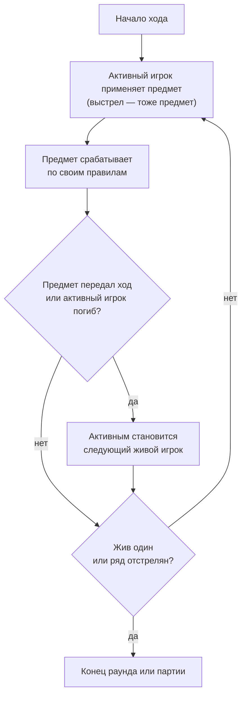
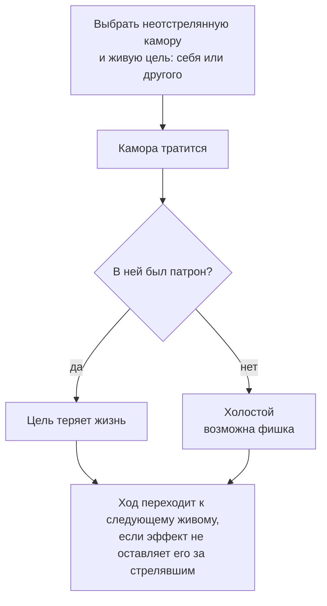

[← Правила игры](README.md)

# Ход

- **Предметы.** Можно применить сколько угодно предметов — лимитирует
  только то, что их мало. Предметы применяются **только в свой ход и
  только пока идёт раунд**: во время подготовки применять их нельзя, даже
  активному игроку.
  Применённый предмет уходит из руки (выстрел — нет, он не тратится).
  Если сработать ему не на чем — например, добавить патрон некуда или
  выбранная цель уже мертва, — предмет всё равно тратится впустую.
  Отклоняется только применение, которое невозможно в принципе: предмета
  нет в руке, сейчас не ход игрока или не идёт раунд.
  Что делает предмет — в его описании в [`items.md`](items.md). Кто
  видит применения — см. [видимость](visibility.md).
- **Номер хода.** Ходы партии нумеруются по порядку: первый ход партии —
  первый, каждая передача хода начинает следующий. Номер не сбрасывается
  между раундами. Если раунд закончился, а ход передан не был, следующий
  раунд продолжает тот же ход с тем же номером.
- **Передача хода.** Ход передаёт не «конец хода» сам по себе, а
  действие: каждый предмет сам решает, передаёт ли он ход. Обычные
  предметы ход не передают, выстрел передаёт.
- **Закончить ход можно только действием, которое передаёт ход**, —
  или гибелью либо выбыванием активного игрока (см. ниже). Выстрел
  доступен всегда, поэтому ход не может тянуться бесконечно, а раунд —
  не закончиться. Отдельный предмет может передать ход и без выстрела
  (см. [`items.md`](items.md)).
- **Активный игрок погиб или выбыл.** Если активный игрок погиб или
  выбыл насовсем — в свой ход или во время подготовки, — ход сразу
  переходит к следующему живому игроку. Это обычная передача хода: номер
  хода растёт.
- **Исход проверяется после каждого действия** — когда действие
  сработало целиком, включая передачу хода. Если жив один — конец
  партии. Если ряд отстрелян — конец раунда, даже если последнюю камору
  потратил предмет, а не выстрел: стрелять больше некуда.

## Выстрел

Выстрел — особый предмет: он есть у каждого всегда и не тратится.

- **Выбор.** Любая неотстрелянная камора (не по кругу, не курсором) и
  цель — себя или другой **живой** игрок. Выстрел из отстрелянной каморы
  или в мёртвую цель отклоняется: ход продолжается, как будто выстрела не
  было.
- **Результат.** Если в каморе был патрон — цель теряет жизнь. Когда
  холостой выстрел приносит фишку — см. [фишки](chips.md).
- **Передача хода.** Выстрел передаёт ход следующему живому игроку, если
  эффект на стрелявшем не оставляет ход за ним. Дополнительного хода нет
  ни при каком исходе выстрела.
